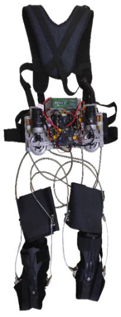
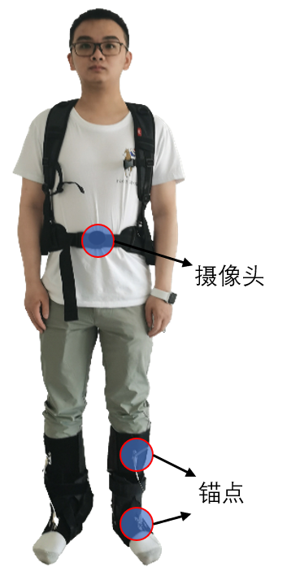

# University of Notre Dame ✨ Computer Science Engineering
# Xi'an Jiaotong University ✨ Institute of Robotics & Intelligent System
---
## ***Research Projects***
## 1. Design of lower limb ankle cable-driven exoskeleton robot

[Project Details](https://github.com/adlsn/Lower-limb-ankle-lasso-exoskeleton-robot)

#### To help the elderly walk normally, I designed a *`cable-driven exoskeleton robot`* in this project. The robot provides tension to the human ankle joint through a back-powered box to reduce human movement metabolism. The robot is equipped with a *`depth camera`* in the front, which uses a *`semantic segmentation`* deep learning model to determine the current motion scene and optimize the motion control of the robot. The structure of the robot is shown in Figure 1.
---

 

> Figure 1. Lower limb ankle lasso exoskeleton robot
  

---
## 2. Stream surface clustering based on GCN contrasting learning

[Project Details](https://github.com/adlsn/Surf-Patch)

#### Particles in a 3D flow field form the stream surface. Tornado, Bernard, and two swirls are typical flow data. In this project, we want to use multiple `surfpatches` to characterize stream surface features, cluster these patches by their inherent patterns, and assist domain experts in attaining and analyzing similar surfaces.
---

 

> Figure 2. Stream surface
  

--- 
## 3. Aorta vessel semantic segmentation

[Project Details](https://github.com/adlsn/Aorta_Segmentation)

#### Vascular segmentation plays an essential role in medical images. The volume of vessels from medical images can be used to reconstruct the 3D mesh of blood vessels, and the 3D mesh of blood vessels can be used for the simulation analysis of blood pressure and flow. In this project, we mainly focus on `aorta` vessels and use a semantic segmentation model based on `U-Net` and `image gradients` to segment the trunk and branches of vessels.
---

 

> Figure 3. Aorta vessel semantic segmentation
  

---
## 4. Semantic segmentation scene perception method

[Project Details](https://github.com/adlsn/Visual-perception-control-project-of-Exoskeleton-Robot)

#### The exoskeleton robot needs to switch different gait to adapt to various terrains. The traditional human-robot interaction control method is complicated and inefficient, so I propose an exoskeleton control strategy based on *`visual perception control`*. The technique recognizes different terrains such as flat ground, stairs, etc., using a *`semantic segmentation`* deep learning model, and controls the exoskeleton by a *`finite state machine`*. The recognition effect of the method is shown in Figure 2.
---

  
 
  
  

  
> Figure 4. Multi-terrain semantic segmentation
  

  
---
## 5. Research on visual perception of spherical robots

[Project Details](https://github.com/adlsn/Spherical-robot-machine-vision)

#### The spherical robot is a reconnaissance robot, so it needs to have a strong environment perception capability. The spherical robot is composed of two symmetrical flywheel mechanisms with cameras mounted on both sides. In this project, I focused on the *`panoramic stitching technique`* under binocular vision and the target detection technique under HSV color space. Figure 3 shows the 3D design and prototype of the robot.
---

  

  
  

  
> Figure 5. 3D design model of a spherical robot based on binocular vision
  

---
## 6. Study on tactile sEMG signal of exoskeleton gloves

[Project Details](https://github.com/adlsn/sEMG-processing-software-design)

#### This project designed a hand exoskeleton to help rehabilitate patients with hand disorders. In this project, I developed a *`3D signal construction method`* using human surface electromyogram (sEMG) signals as a neural network input. I built a *`full-dimensional convolutional analysis network`* to output the hand motion intention.

---

  
> Figure 6. Exoskeleton gloves, the left is the 1st generation, and the right is the 2nd generation
  

  
---

  

  
  

<!--
**adlsn/adlsn** is a ✨ _special_ ✨ repository because its `README.md` (this file) appears on your GitHub profile.

Here are some ideas to get you started:

- 🔭 I’m currently working on ...
- 🌱 I’m currently learning ...
- 👯 I’m looking to collaborate on ...
- 🤔 I’m looking for help with ...
- 💬 Ask me about ...
- 📫 How to reach me: ...
- 😄 Pronouns: ...
- ⚡ Fun fact: ...
-->
