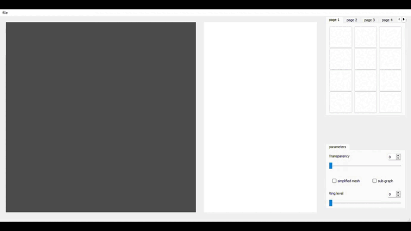

# University of Notre Dame ✨ Computer Science Engineering
---
## ***Research Projects***

## 1. Stream Surface Clustering using GCN

[Project Details](https://github.com/adlsn/Surf-Patch)

#### The surface of a stream is formed by particles in a 3D flow field, which can include data such as tornadoes, Bernard cells, and swirls. Our project aims to identify and analyze these stream surface features using multiple `surfpatches` and grouping them based on their unique patterns. This will help domain experts to better understand and analyze similar surfaces.
---

  

 

  
> Figure 1. Custom UI for Stream surface

--- 

<!--
**adlsn/adlsn** is a ✨ _special_ ✨ repository because its `README.md` (this file) appears on your GitHub profile.

Here are some ideas to get you started:

- 🔭 I’m currently working on ...
- 🌱 I’m currently learning ...
- 👯 I’m looking to collaborate on ...
- 🤔 I’m looking for help with ...
- 💬 Ask me about ...
- 📫 How to reach me: ...
- 😄 Pronouns: ...
- ⚡ Fun fact: ...
-->
