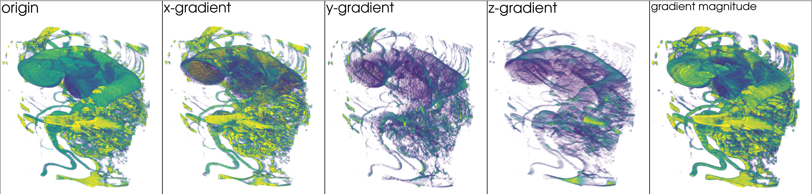
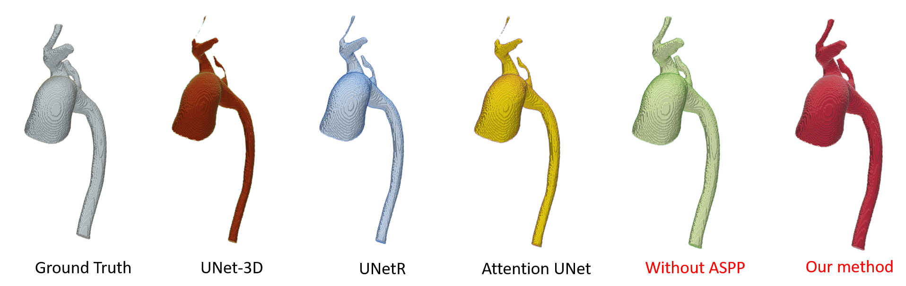

# University of Notre Dame ✨ Computer Science Engineering
# Xi'an Jiaotong University ✨ Institute of Robotics & Intelligent System
---
## ***Research Projects***
## 1. Design of Lower Limb Joint-Assistive Exoskeleton Robot

[Project Details](https://github.com/adlsn/Lower-limb-ankle-lasso-exoskeleton-robot)

#### In order to assist the elderly with walking, I created a *`robot exoskeleton`* that uses cables for movement. The robot applies pressure to the ankle joint through a powered box, which helps to reduce the amount of energy needed to move. Additionally, the robot is equipped with a *`front-facing depth camera`* that uses a deep learning model to analyze the current surroundings and improve the robot's motion control. See Figure 1 for a detailed view of the robot's structure.
---

 

> Figure 1. Lower limb ankle joint-assistive exoskeleton

---
## 2. Contrastive Learning-Based Stream Surface Clustering using GCN

[Project Details](https://github.com/adlsn/Surf-Patch)

#### The surface of a stream is formed by particles in a 3D flow field, which can include data such as tornadoes, Bernard cells, and swirls. Our project aims to identify and analyze these stream surface features using multiple `surfpatches` and grouping them based on their unique patterns. This will help domain experts to better understand and analyze similar surfaces.
---

 

> Figure 2. Custom UI for Stream surface

--- 
## 3. Semantic Segmentation of Aorta Vessels: An Advanced Approach

[Project Details](https://github.com/adlsn/Aorta_Segmentation)

#### Vascular segmentation plays a crucial role in medical image analysis as it enables the extraction of valuable information regarding blood vessels. By accurately delineating the vessels, we can obtain volumetric data that can be utilized for reconstructing a comprehensive 3D mesh representation. The resulting 3D mesh is invaluable for conducting simulation analyses, particularly in the assessment of blood pressure and flow dynamics. In this project, our primary focus lies on segmenting the vessels of the aorta, a significant artery in the human body. To achieve this, we employ a semantic segmentation model based on the well-established U-Net architecture, augmented with the utilization of image gradients for enhanced accuracy. Our methodology aims to precisely identify and classify both the main trunk and intricate branches of the aorta vessels, facilitating a comprehensive understanding of their structure and characteristics.
---

 

>  3. Semantic Segmentation of Aorta Vessels

---
## 4. Advancing Scene Perception through Semantic Segmentation Methods

[Project Details](https://github.com/adlsn/Visual-perception-control-project-of-Exoskeleton-Robot)

#### This research proposes a streamlined exoskeleton control strategy based on visual perception. By leveraging a deep learning model for *`semantic segmentation`*, different terrains like flat ground and stairs can be accurately recognized. The exoskeleton adjusts its gait accordingly to adapt to the terrain, enhancing efficiency. The control system employs a `finite state machine` architecture, ensuring precise coordination of exoskeleton movements based on the recognized terrain type. Figure 4 demonstrates the effective terrain recognition capabilities and successful integration of the proposed method into the exoskeleton control system.
---

  
 
  

> Figure 4. Semantic Segmentation for Multi-Terrain Environments

  
---
## 5. Advancing Visual Perception in Spherical Robots

[Project Details](https://github.com/adlsn/Spherical-robot-machine-vision)

#### Strengthening the environment perception capabilities of spherical reconnaissance robots, this project focuses on two key techniques: `panoramic stitching` under the binocular vision and target detection using the HSV color space. The robot, equipped with symmetrical flywheel mechanisms and cameras on both sides, seamlessly stitches together panoramic views to form a comprehensive visual representation. By leveraging the HSV color space, the robot efficiently detects and tracks targets of interest. The 3D design and prototype of the robot are showcased in Figure 5, highlighting the successful implementation of these techniques.
---

  

  
> Figure 5. Spherical Robot Design through Binocular Vision-Based 3D Modeling

---
## 6. Tactile sEMG Signals in Exoskeleton Gloves

[Project Details](https://github.com/adlsn/sEMG-processing-software-design)

#### This project aimed to assist patients with hand disorders through the development of a specialized hand exoskeleton. Within this endeavor, I devised a novel 3D signal construction method utilizing surface electromyogram (sEMG) signals as inputs for a neural network. To accurately capture hand motion intention, a robust full-dimensional convolutional analysis network was constructed. These advancements contribute to the field of hand rehabilitation by enabling precise and intuitive control of the exoskeleton based on sEMG signals.

---

> Figure 6. Exoskeleton gloves, the left and right are the 1st and 2nd generation, respectively

  
---

  

  

<!--
**adlsn/adlsn** is a ✨ _special_ ✨ repository because its `README.md` (this file) appears on your GitHub profile.

Here are some ideas to get you started:

- 🔭 I’m currently working on ...
- 🌱 I’m currently learning ...
- 👯 I’m looking to collaborate on ...
- 🤔 I’m looking for help with ...
- 💬 Ask me about ...
- 📫 How to reach me: ...
- 😄 Pronouns: ...
- ⚡ Fun fact: ...
-->
